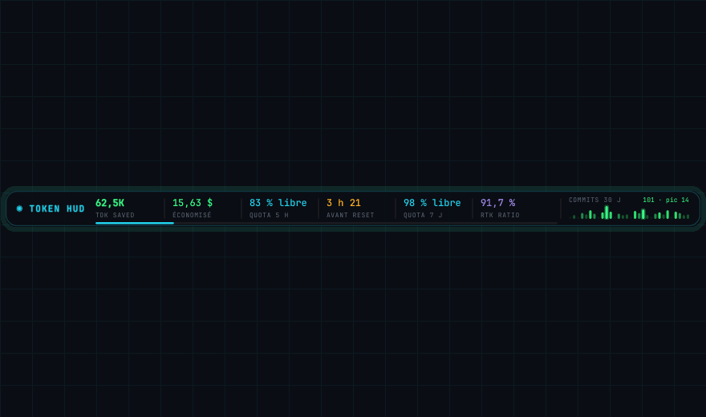
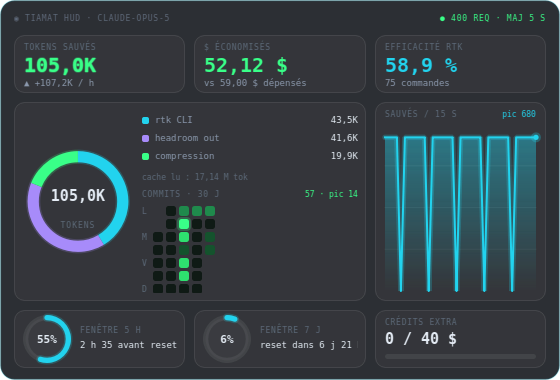
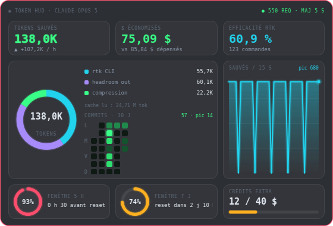

# Tiamat HUD

Neon, Grafana-flavoured desktop widget for Claude Code economics: how many tokens
`rtk` and `headroom` saved, how much that is worth, and how much of the Claude
usage window is left.

Frameless, always on top, draggable, no taskbar entry. Two modes share one code
base: a full **dashboard** (560x380) and a collapsed **ticker** bar (720x44).
Double-click switches between them.



Double-click switches between the collapsed ticker and the full dashboard.



## Run

The project is managed with [uv](https://docs.astral.sh/uv/) and driven through a
Makefile.

```sh
make dev    # create .venv and install runtime + dev dependencies
make run    # launch the HUD
make check  # ruff + pytest
```

`make help` lists every target (`install`, `dev`, `run`, `test`, `lint`,
`format`, `check`, `build`, `clean`, `distclean`). Without make: `uv sync` then
`uv run python -m tiamat_hud`, or install the `tiamat-hud` script.

Right-click the widget, or use the tray icon, for: show/hide, mode switch, quit.
Window position and mode are remembered (`QSettings`, `tiamat/hud`).

## Data sources

Everything is read locally except the commit calendar, which is the only network
hop and runs just once every 10 minutes.

| Metric | Source |
| --- | --- |
| Tokens saved, savings ratio, command count | `rtk gain -f json` (30 s) |
| Compression + output savings, cache savings, spend, model | `~/.headroom/proxy_savings.json` (5 s) |
| 5 h / 7 d usage windows, extra credits | `~/.headroom/subscription_state.json` (15 s) |
| Rolling 30-day commit calendar | `gh api graphql` -> `contributionsCollection`, fallback `git log` (600 s) |

Two upstream quirks the code works around:

- `five_hour.limit` is reported as `0`, so absolute "tokens remaining" is not
  derivable. The HUD shows **percentage used + time to reset** instead.
- `seconds_to_reset` ages with the file, so `resets_at` is preferred and the
  countdown is recomputed every second in the UI.

Every read runs in a `QThreadPool` worker; the UI thread only receives a
`Snapshot` via `MetricsStore.snapshotReady`. A missing or malformed source
degrades to empty metrics and a red liveness dot - it never raises.

## Commit heatmap

A GitHub-style rolling month: one column per calendar week, one row per weekday,
dark green to neon green. Levels are **quantile** cut-offs like GitHub's own
graph - a fixed scale would flatten a spiky month - and only the top level gets a
halo, otherwise the whole grid glows and the hierarchy disappears.

- **Dashboard**: sits in the free space under the donut legend, so the window
  stays at 560 x 380.
- **Ticker**: 44 px cannot hold seven rows, so it degrades to one bar per day
  with height *and* colour carrying the count, suffixed after the five original
  readouts.

`gh api graphql` reproduces the profile page exactly, private repos included. If
`gh` is missing or unauthenticated, `git log` over local clones takes over - it
under-reports by construction (only cloned repos, committer email match), so the
panel labels itself `local` in that mode. Both failing leaves the grid empty with
`github indisponible`.


## Alerts



The window border is cyan below 70 % usage, solid orange from 70 %, and pulses
red from 90 % (`theme.WARN_PCT` / `theme.CRIT_PCT`). Quota gauges follow the same
scale.

## History

The trend panel needs points across restarts, so the saved-token series is
persisted to `history.json` under the Qt app-data location (240 points, one every
15 s, older than 6 h dropped on load).

## Layout

```
tiamat_hud/
  __main__.py    entry point, tray, Ctrl+C handling
  hud.py         frameless window, dashboard + ticker views, tray menu
  gauges.py      QPainter widgets: KPI tile, donut, radial gauge, area, thin bar
  store.py       timers, thread pool fan-in, persisted history
  collectors.py  rtk + headroom + quota readers
  model.py       frozen dataclasses passed to the UI
  theme.py       palette, fonts, glow/arc painting helpers
tests/           parsing and threshold tests, no display needed
images/          screenshots used by the README and the review artifact
pyproject.toml   uv/hatchling project definition, ruff and pytest config
Makefile         install, run, test, lint, build, clean
```

## Tests

```sh
make test
```

Covers parsing, threshold colours, formatters and graceful degradation - no
display required.

## Known limits

- Wayland compositors may ignore `WindowStaysOnTopHint` and programmatic moves.
  Run under XWayland (`QT_QPA_PLATFORM=xcb`) if the widget will not stay on top.
- `rtk cc-economics` is currently broken upstream (ccusage: `missing field
  'month'`) and is deliberately not used.
